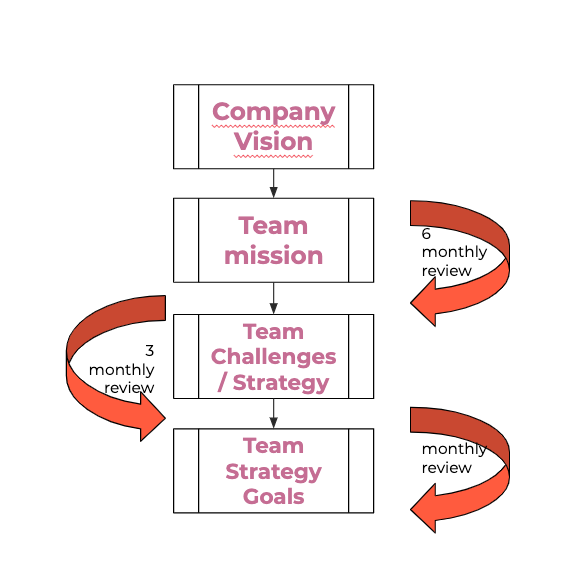

# The PowerPuff Girls (aka TPPG)

## Vision

**The PowerPuff Girls** acquired the vision of HolaLuz as our own ("Connecting people to green energy"), and we adhered to it through the "people" part, understanding these "people" as "everyone" in the world!

## Mission

So, looking towards that vision, The PowerPuff Girls mission is to **drive and help** post-sale **teams** to **make** their business value **delivery more flexible and focused** so we, as Holaluz, are able to connect as many people as possible to green energy **without being limited by our software and technologies**

## Team Challenges / Strategy

Our **main goal** is to provide the teams at HolaLuz with new strategies and tools to enable current and future systems to be scalable, robust and able to support change with the flexibility the business needs. We seek to build the bridges we are lacking to take our systems out of the model that has brought us to the present and start building the ones that should make us shine in the future.

As a team whose purpose is changing over time (as it is aligned with achieving system scalability to synchronize with business needs), we work in cycles of **3 to 6 month of strategic challenges** which are **guided by 1-3 different goals each month** we try to build this strategy and objectives aligned with those of the purpose teams and in collaboration with them, so that in the medium term they can make them their own.

  

## Current areas of work

You can check what we are working on in each quarter of the year at the following **[link](https://docs.google.com/presentation/d/1pa1xn5x5Wnr4VKBlvx4Ok7Ey3cWlDL-bxhhh0GNPEso/edit?usp=sharing)**

## 2020  

### Q2 2020
> **Primary focus** - Invocing: Invoice communications extraction from ERP  
> - Goal 1: extract DHS product invoice printing/mailing from Ekon (to KillBill)  
> - Goal 2: extract "Sin Sorpresas" product invoice printing/mailing from Ekon (to KillBill)
> - NOT CONFIRMED Goal 3: extract pre-invoice printing/mailing from Ekon (to KillBill)

> **Secondary focus** - Ekon → NetSuite migration
> - Goal 1: Analyze (RSM BRD) & refine Ekon -> NetSuite migration

### Q3 2020
> **Primary focus** - Ekon → NetSuite migration - Phase I  
> - Goal 1: Automation of opening balances loading
> - Goal 2: Extract remittance collection/payment from Ekon
> - NOT CONFIRMED Goal 3: Analytical accounting, first draft

** always WIP and evolving

### Contact
* Via Slack, public channel: **#eng-powerpuff-girls** or mentioning: **@tppg**
* Via mail: **powerpuffs@holaluz.com**
